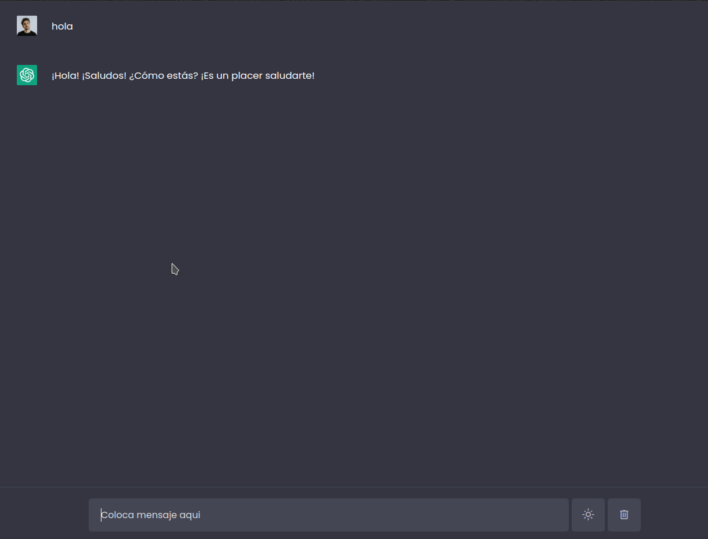

## frontend y backend de ChatBot

Aplicacion frontend servida por nodejs y backend desarrollada en python, con tecnologías como fastpi, langchain, openai para conectar los mensajes del chatbot con el LLM de OpenAI

